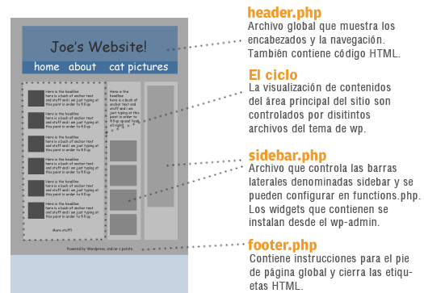
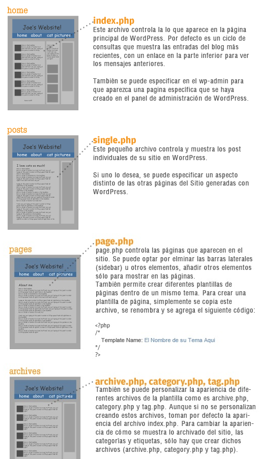
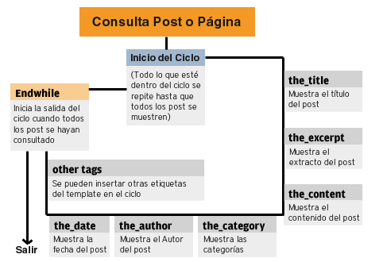

# Clase 2

[comment]: # (Material completo)

## Introducción a PHP

PHP es un lenguaje de programación del lado del servidor (o _server-side_). A diferencia de lenguajes del lado del cliente (_client-side_), como JavaScript, que son interpretados directamente en el navegador, los lenguajes de servidor necesitan un servidor web para poder operar. Esa es la razón de que necesitemos herramientas como XAMPP o MAMP para ejecutar código PHP localmente, ya que instalan en nuestro sistema operativo servicios como Apache y el mismo intérprete de PHP, además de MySQL o MariaDB, que son motores de bases de datos.

PHP fue creado en 1994 por Rasmus Lerdorf, quien lo utilizó originalmente para mantener su sitio web personal. Durante sus primeras dos versiones el acrónimo "PHP" significó "Personal Home Pages", pero su significado se modificó por el acrónimo recursivo "PHP Hypertext Preprocessor" a partir de PHP3.

Debido a su distribución libre, y a su facilidad de uso e instalación, PHP está disponible en casi todos los servicios de hosting, y al día de hoy es el lenguaje de programación más utilizado para construir sitios web dinámicos. Parte de su éxito también se debe a que los tres CMS más populares, es decir WordPress, Drupal y Joomla, además de Magento, la herramienta más potente en el mercado para construcción de sitios de e-commerce, están desarrollados con PHP.

### Tags de apertura y cierre

PHP es un lenguaje de programación orientado a imprimir y procesar texto. Por esto mismo, todo aquello que escribimos de manera directa en un archivo con extensión `.php` puede ser interpretado como texto plano, HTML o XML, dependiendo del formato de marcado con el que lo escribamos. De esta manera, un archivo PHP en el cual solamente tengamos un contenido como el siguiente se va a ver igual que si el archivo tuviera la extensión `.html`:

```html
<!DOCTYPE html>
<html>
  <head>
    <title>Mi sitio web</title>
  </head>
  <body>
    <p>Hola Mundo!</p>
  </body>
</html>
```

Sin embargo, con la introducción en este archivo de las etiquetas de apertura y cierre de PHP, `<?php` y `?>` respectivamente, todo lo que escribamos entre esas etiquetas pasa a interpretarse como código PHP:

```php
<!DOCTYPE html>
<html>
  <head>
    <title>Mi sitio web</title>
  </head>
  <body>
    <p>Lista de compras:</p>
    <ul>
      <?php
        $productos = array( 'Pan', 'Azúcar', 'Harina', 'Vino' );

        foreach( $productos as $producto ) {
          echo '<li>' . $producto . '</li>';
        }
      ?>
    </ul>
  </body>
</html>
```

No importa si en este punto el código todavía es incomprensible, pero sí puede notarse, en base al ejemplo, cómo el HTML correspondiente a la lista de compras se genera dinámicamente por medio de PHP.

### Comentarios

En todos los lenguajes de programación existe alguna manera de dejar comentarios de texto para uso propio o de otros desarrolladores, a manera de documentación interna. Estos comentarios pueden escribirse dentro de los mismos archivos donde se escribe el código, sin tener ningún tipo de impacto en la aplicación.

En PHP pueden escribirse dos tipos de comentarios:

#### Comentarios de línea única

Con `//` y `#` pueden iniciarse comentarios que solamente se extienden por una línea del código:

```php
<?php
// Imprimo texto:
echo '¡Hola Mundo!';
# Se imprime "¡Hola Mundo!"
?>
```

#### Comentarios de líneas múltiples

Comentarios más extensos, que puedan llegar a contar con varias líneas, deben iniciarse con `/*` y terminar con `*/`.

```php
<?php
/*
Yo imprimo texto porque me gusta imprimir texto
Yo nací para imprimir texto...
*/
echo '¡Hola Mundo!';
?>
```

### Variables
Las variables son elementos de un lenguaje de programación que permiten guardar ciertos datos de una aplicación para luego poder reutilizarlos.

En PHP, las variables se nombran con el signo `$` y un nombre alfanumérico (letras de la A a la Z, sin caracteres especiales ni acentos, y números del 0 al 9). Permiten, además, el caracter `_` (guión bajo, o *underscore*).

Para asignarles un valor se usa el caracter `=`, y a continuación se declara dicho valor. La declaración termina con `;`.

```php
<?php
$mensaje = '¡Hola mundo!';
?>
```

Las variables llevan ese nombre debido a que el valor que se les asigna puede cambiar de un momento a otro, es decir que las variables pueden sobreescribirse.

Ejemplo:

```php
<?php
$mensaje = '¡Hola mundo!'; // Se declara el valor de la variable.

echo $mensaje; // Se imprime en pantalla "¡Hola mundo!"

$mensaje = '¿Cómo estás?'; // Se redeclara el valor de la variable.

echo $mensaje; // Se imprime en pantalla "¿Cómo estás?"
?>
```

### Constantes

Son similares a las variables, con la diferencia de que no pueden sobreescribirse. También difieren en que se las declara con la función `define()`, y no hace falta que lleven el símbolo `$`. Generalmente se usan para guardar datos de configuración de una aplicación, y por convención se las declara con mayúsculas.

```php
<?php
define( 'MENSAJE', '¡Hola mundo!' );

echo MENSAJE; // Imprime "¡Hola mundo!".
?>
```

### Impresión de texto

Para imprimir texto en PHP usamos comúnmente la construcción `echo`. Es un comando que acepta uno o más argumentos y los imprime en pantalla como texto plano o HTML.

De esta manera, podemos imprimir el valor de una variable:

```php
<?php
$mensaje = '¡Hola mundo!';

echo $mensaje;
?>
```

O un valor de forma directa:

```php
<?php
echo '¡Hola mundo!';
?>
```

O valores múltiples, separándolos con comas:

```php
<?php
$mensaje1 = '¡Hola mundo!';
$mensaje2 = '¿Cómo estás!';

echo $mensaje1, $mensaje2;
?>
```

Otra construcción que sirve para imprimir texto es `print`, pero a diferencia de `echo`, solamente acepta un único parámetro.

Por ejemplo, este es un uso válido de `print`:

```php
<?php
$mensaje = '¡Hola mundo!';

print $mensaje;
?>
```

Y el siguiente es un uso inválido:

```php
<?php
$mensaje1 = '¡Hola mundo!';
$mensaje2 = '¿Cómo estás!';

print $mensaje1, $mensaje2;
?>
```

### Tipos de datos

PHP soporta distintos tipos de datos, los cuales pueden cumplir con diferentes propósitos dentro de una aplicación.

Debido a que el lenguaje no es declarativo acerca del tipo de datos que se asignan a variables (es decir que al momento de crear la variable no se especifica de qué tipo es el dato contenido), PHP reconoce el tipo de cada dato de forma automática, y al mismo tiempo otorga cierta flexibilidad al comparar entre diferentes tipos.

#### Booleano

El booleano (también *boolean* o *bool*) es el más simple de todos los tipos de datos, y representa un valor de verdad, el cual puede ser `true` (verdadero) o `false` (falso). Normalmente se lo utiliza para evaluar condiciones.

En el siguiente ejemplo se asigna un valor verdadero a la variable `$foo`, y un valor falso a la variable `$bar`:

```php
<?php
$foo = true;
$bar = false;
?>
```

#### Entero

Los números enteros son conocidos como `integer` o `int`, y corresponden a todo número sin decimales igual, mayor o menor a cero. También se interpretan como enteros (aunque son poco utilizados) aquellos expresados en los sistemas octal, hexadecimal y binario.

Ejemplos de números enteros válidos:

```php
<?php
$a = 1234; // Número decimal.
$a = -123; // Número negativo.
$a = 0123; // Número octal (equivalente a 83 decimal).
$a = 0x1A; // Número hexadecimal (equivalente a 26 decimal).
$a = 0b11111111; // Número binario (equivalente a 255 decimal).
?>
```

#### Número de punto flotante

También conocido como *float*, es un dato numérico que puede ser expresado como cualquier tipo de número real, aunque principalmente se lo usa con decimales.

```php
<?php
$a = 1.0;
$b = 1.01;
$c = 100.123;
?>
```

#### Cadenas de caracteres

También llamado *string*, es un tipo de dato expresado como una cadena de caracteres en diferentes formatos, aunque los más utilizados son los siguientes:

##### Comillas simples o dobles

El uso de ambos tipos de comillas suele producir resultados similares, aunque existen algunas diferencias considerables entre cada uno.

Por ejemplo, la siguiente pieza de código imprime exactamente el mismo texto para los dos casos:

```php
<?php
echo "¡Hola Mundo!"; // Imprime "¡Hola Mundo!";
echo '¡Hola Mundo!'; // Imprime "¡Hola Mundo!";
?>
```

Sin embargo, en este caso se presentan diferencias:

```php
<?php
$mensaje = '¿Cómo estás?';

echo "¡Hola Mundo! $mensaje"; // Imprime "¡Hola Mundo! ¿Cómo estás?";
echo '¡Hola Mundo! $mensaje'; // Imprime "¡Hola Mundo! $mensaje";
?>
```

Como se ve en el ejemplo, usando comillas dobles, las variables dentro del texto se interpretan como tales; mientras que, usando comillas simples, se interpreta como texto el nombre de la variable.

Para resolver este problema con las comillas simples, puede usarse una concatenación de texto:

```php
<?php
$mensaje = '¿Cómo estás?';

echo "¡Hola Mundo! $mensaje"; // Imprime "¡Hola Mundo! ¿Cómo estás?";
echo '¡Hola Mundo! ' . $mensaje; // Imprime "¡Hola Mundo! ¿Cómo estás?";
?>
```

Por otra parte, una limitacion de las comillas dobles es que no soportan saltos de línea ni tabulaciones.

```php
<?php
$mensaje = "¡Hola Mundo!
  ¿Cómo estás?";

echo $mensaje;
// Imprime:
// ¡Hola Mundo! ¿Cómo estás?

$mensaje = '¡Hola Mundo!
  ¿Cómo estás?';

echo $mensaje;
// Imprime:
// ¡Hola Mundo!
//   ¿Cómo estás?
?>
```

Según el ejemplo, la impresión derivada de la variable declarada con comillas simples respetó el salto de línea y la tabulación, pero la derivada de la variable con comillas dobles fue de una única línea. Para que estos caracteres sean respetados por las comillas dobles, necesitamos reponerlos con las expresiones `\b`, para el salto de línea, y `\t` para la tabulación.

```php
<?php
$mensaje = "¡Hola Mundo!\b
\t¿Cómo estás?";

echo $mensaje;
// Imprime:
// ¡Hola Mundo!
//   ¿Cómo estás?

$mensaje = '¡Hola Mundo!
  ¿Cómo estás?';

echo $mensaje;
// Imprime:
// ¡Hola Mundo!
//   ¿Cómo estás?
?>
```

Una limitación de ambos tipos de comillas es que no pueden contenerse a sí mismos dentro de las cadenas que encierran:

```php
<?php
$mensaje = "<p class="texto">¡Hola Mundo!</p>";
echo $mensaje; // Imprime un error.

$mensaje = '<p class='texto'>¡Hola Mundo!</p>';
echo $mensaje; // Imprime un error.
?>
```

Esto ocurre porque PHP interpreta que la primera comilla que aparece en el texto está cerrando la declaración, y toma el código que está a continuación como inválido, por lo cual da un error. Para evitar este problema existen dos posibles soluciones: intercalar tipos de comillas o realizar un escape de caracteres con `\`.

```php
<?php
$mensaje = "<p class='texto'>¡Hola Mundo!</p>"; // Intercalando tipos de comillas.
echo $mensaje;
// Imprime:
// <p class='texto'>¡Hola Mundo!</p>

$mensaje = "<p class=\"texto\">¡Hola Mundo!</p>"; // Escapando caracteres.
echo $mensaje;
// Imprime:
// <p class="texto">¡Hola Mundo!</p>

$mensaje = '<p class="texto">¡Hola Mundo!</p>'; // Intercalando tipos de comillas.
echo $mensaje;
// Imprime:
// <p class="texto">¡Hola Mundo!</p>

$mensaje = '<p class=\'texto\'>¡Hola Mundo!</p>'; // Escapando caracteres.
echo $mensaje;
// Imprime:
// <p class='texto'>¡Hola Mundo!</p>
?>
```

##### Concatenación

La concatenación es la unión de dos o más cadenas de caracteres. En PHP existen dos maneras de concatenar caracteres.

###### Concatenación simple

Con el caracter `.` (punto) pueden unirse dos cadenas de texto al momento de imprimir o asignar.

```php
<?php
$mensaje = '¡Hola Mundo!';

echo $mensaje . ' ¿Cómo estás?'; // Imprime "¡Hola Mundo! ¿Cómo estás?".
?>
```

###### Concatenación por asignación

También pueden concatenarse textos por medio de una nueva asignación a una variable previamente declarada. Para eso se usa el operador `.=`, el cual añade el nuevo valor al final de la cadena original.

```php
<?php
$mensaje = '¡Hola Mundo!';
$mensaje .= ' ¿Cómo estás?';

echo $mensaje; // Imprime "¡Hola Mundo! ¿Cómo estás?".
?>
```

#### Arrays

Un array es lo que se entiende en programación como un mapa ordenado de datos. Básicamente, permite agrupar diferentes datos de manera ordenada con una combinación de clave y valor.

**Ejemplo:**

```php
<?php
$lista = array( 0 => 'Pan', 1 => 'Leche', 2 => 'Azúcar' );

echo $lista[0]; // Imprime "Pan".
echo $lista[1]; // Imprime "Leche".
echo $lista[2]; // Imprime "Azúcar".
?>
```

También es posible no especificar la clave de cada elemento. En esos casos, PHP asigna una clave numérica al elemento de forma automática.

```php
<?php
$lista = array( 'Pan', 'Leche', 'Azúcar' );

echo $lista[0]; // Imprime "Pan".
echo $lista[1]; // Imprime "Leche".
echo $lista[2]; // Imprime "Azúcar".
?>
```

Las claves pueden especificarse también como cadenas de texto, y luego accederse como tales:

```php
<?php
$lista = array( 'cero' => 'Pan', 'uno' => 'Leche', 'dos' => 'Azúcar' );

echo $lista['cero']; // Imprime "Pan".
echo $lista['uno'];  // Imprime "Leche".
echo $lista['dos'];  // Imprime "Azúcar".
?>
```

Incluso aunque las claves se especifiquen como texto, también siguen siendo accesibles según su posición:

```php
<?php
$lista = array( 'cero' => 'Pan', 'uno' => 'Leche', 'dos' => 'Azúcar' );

echo $lista[0]; // Imprime "Pan".
echo $lista[1]; // Imprime "Leche".
echo $lista[2]; // Imprime "Azúcar".
?>
```

### Estructuras de control

Las estructuras de control sirven para evaluar datos y, en base a sus resultados, ejecutar alguna acción determinada en la aplicación. Existen diferentes tipos de estructuras de control.

#### Condicionales

##### if / elseif / else

La estructura `if()` es la más simple de las estructuras de control, y solamente evalúa si un resultado es verdadero o falso. En caso de que la evaluación sea verdadera, ejecuta el código contenido dentro de la estructura.

```php
<?php
$a = true;
$mensaje = '¡Hola Mundo!';

// Se evalúa si $a es igual a true.
if ( $a == true ) {
  // Si la evaluación es verdadera, se imprime el mensaje.
  echo $mensaje;
}

?>
```

Un detalle importante a notar es que los valores booleanos pueden evaluarse sin necesidad de usar operadores de comparación. Teniendo eso en cuenta, el siguiente código es equivalente al anterior:

```php
<?php
$a = true;
$mensaje = '¡Hola Mundo!';

// Se evalúa si $a es igual a true.
if ( $a ) {
  // Si la evaluación es verdadera, se imprime el mensaje.
  echo $mensaje;
}
?>
```

En caso de que se necesiten evaluaciones adicionales para ejecutar procesos alternativos, puede introducirse `elseif()` a la estructura de control.

```php
<?php
$a = false;
$b = true;

$mensaje_a = '¡Hola Mundo!';
$mensaje_b = ':(';

if ( $a ) {
  echo $mensaje;
} elseif( $b ) {
  echo $b;
}
?>
```

Si se quiere ejecutar un proceso por defecto en caso de que no cumpla ninguna condición de la estructura, puede introducirse `else`.

```php
<?php
$a = false;
$b = false;

$mensaje_a = '¡Hola Mundo!';
$mensaje_b = ':(';

if ( $a ) {
  echo $mensaje;
} elseif( $b ) {
  echo $b;
} else {
  echo ':\'('; // Imprime ":'(".
}
?>
```

##### switch

Para evitar largas estructuras de `if/elseif/else`, puede usarse la estructura `switch`.

```php
<?php
$a = 'Hola';

switch ( $a ) {
  case 'Hola':
    echo '¡Hola Mundo!';
    break;
  case 'Chau':
    echo 'Chau Mundo :(';
    break;
  default:
    echo ':(';
}
?>
```

De esta manera, evaluamos si el valor que se le da a `switch()` como parámetro es igual a alguno de los casos especificados en la estructura. Si es igual, se ejecuta el código contenido en el caso correspondiente. De lo contrario, de ejecuta el código contenido en `default`.

#### Bucles

##### while

Es una de las estructuras de control del tipo bucle, o *loop*. Esto significa que la estructura se repetirá un número dado de veces (o iteraciones), hasta que se le indique que debe dejar de ejecutarse.

**Ejemplo:**

```php
<?php
$i = 0; // Se inicializa un contador.

// Mientras $i sea menor o igual a 5...
while ( $i <= 5 ) {
  echo $i; // Se imprime $i.
  $i++;    // Se suma 1 a $i.
}

// Se imprime "012345".
?>
```

Es muy importante cortar el ciclo en alguna de sus iteraciones ya que, de lo contrario, el bucle se ejecutará al infinito, lo cual puede llegar a colgar el equipo debido a un alto consumo de memoria.

##### for

Es similar a `while`, aunque un poco menos semántico, lo cual puede hacerlo más difícil de entender.

A diferencia de `while`, `for` está exclusivamente pensado para operar con valores numéricos. Además, recibe una tríada de parámetros separados por `;`. El primer parámetro es el estado inicial del bucle, el segundo es la condición de corte, y el tercero es una operación a realizar al final de cada iteración.

El ejemplo anterior con `while` puede reformularse con `for` de esta manera:

```php
<?php
for ( $i = 0; $i <= 5; $i++ ) {
  echo $i; // Se imprime $i.
}

// Se imprime "012345".
?>
```

##### foreach

Se utiliza para iterar sobre arrays. Recibe como parámetro el array que se planea iterar y genera una o dos nuevas variables que permiten acceder al contenido de cada elemento iterado.

```php
<?php
$lista = array( 'Pan', 'Leche', 'Azúcar' );

foreach ( $lista as $item ) {
  echo $item; // Imprime cada elemento de la lista.
}
?>
```

También puede accederse por separado a la clave y valor de cada elemento:

```php
<?php
$lista = array( 'Pan', 'Leche', 'Azúcar' );

foreach ( $lista as $clave => $valor ) {
  echo $clave . ': ' . $valor; // Imprime cada elemento de la lista.
}
?>
```

---

## Themes y Child Themes

### Estructura básica de un theme

Para tener un amplio conocimiento sobre todo lo que representa WordPress es necesario conocer cómo es la estructura de una página, para qué sirve cada uno de los archivos que son parte del theme a desarrollar, y los procesos internos que permiten que los contenidos cargados se muestren al visitante de un sitio.

#### Anatomía de un theme de WordPress



Los themes de WordPress se componen de una carpeta de archivos, cada uno de los cuales controla una parte específica del theme.



#### El ciclo

Es la parte más poderosa del theme de WordPress, se inicia con una consulta (que determina los mensajes y páginas a mostrar) y termina con un end while de PHP. Todo lo demás de ti, puedes específicar cómo se muestran los títulos, el contenido de cada post, los metadatos, campos personalizados y de los comentarios.

Se pueden configurar múltiples ciclos en una misma página.



---

### Jerarquía de ejecución y lectura de archivos (Template Hierarchy)

https://developer.wordpress.org/themes/basics/template-hierarchy/

https://wphierarchy.com/

WordPress usa la Cadena de Consulta (o query string) —información contenida dentro de cada URL del sitio— para decidir qué modelo o conjunto de las plantillas se utiliza para mostrar la página.

En primer lugar, WordPress se relaciona cada query string al tipo de consulta —es decir, decide qué tipo de página (una página de búsqueda, una página de categoría, la página de inicio, etc) se está solicitando.

Las plantillas son elegidas entonces —y el contenido de la página web se genera— en el orden sugerido por la jerarquía de plantillas de WordPress, dependiendo de la disponibilidad de las plantillas (templates) en el theme activo.

WordPress busca templates con nombres específicos en el directorio del theme y utiliza la primera coincidencia con el template listado bajo la consulta apropiada. Si WordPress no puede encontrar un template con el nombre correspondiente, pasa al siguiente nombre de archivo en el orden de jerarquía. Si WordPress no puede encontrar ningún template, se usará `index.php`, que es el único template obligatorio para construir un theme.

#### Ejemplos

Si un sitio está en `http://domain.com/` y un visitante visita el enlace de una página de categoría como `http://domain.com/category/your-cat/`, WordPress busca un template en el directorio del Tema actual que conincida con el ID de la categoría. Si el ID de la categoría es 4, WordPress busca un template llamado `category-4.php`. Si no aparece, después WordPress busca un template para una categoría genérica, `category.php`. Si este archivo tampoco existe, WordPress busca un template generico, `archive.php`. Si este tampoco aparece, WordPress vuelve al archivo principal del, `index.php`.

Si un visitante va a tu página de inicio en `http://domain.com/`, WordPress busca un template llamado `home.php` y lo usa para general la página pedida. Si `home.php` no aparece, WordPress busca un archivo llamado `index.php`, y lo usa para generar la página.

#### Panorama visual

El siguiente diagrama muesta qué template es llamado para generar una página WordPress basado en la jerarquía de Templates de WordPress.


#### La Jerarquía de Plantillas en detalle

Las siguientes secciones describen el orden en el cual son llamadas los archivos de plantillas por WordPress para cada uno de los tipos de consultas.

##### Página principal

1. front-page.php
2. home.php
3. index.php

##### Blog

1. home.php
2. index.php

##### Post

1. single.php
2. index.php

##### Página

1. La plantilla seleccionada desde el desplegable "Plantilla de la página (Page Template)" al editar la página.
2. page.php
3. index.php

##### Categoría

1. La Plantilla de Categoría con una coincidencia de ID. Si el ID de la categoría fuera 6, WordPress buscaría `category-6.php`.
2. category.php
3. archive.php
4. index.php


##### Etiqueta (Tag)

1. La Plantilla de Etiqueta que coincida con el slug. Si el slug de la etiqueta fuera `sometag`, WordPress buscaría `tag-sometag.php`.
2. tag.php
3. archive.php
4. index.php

##### Autor

1. author.php
2. archive.php
3. index.php

##### Fecha (por archivo mensual)

1. date.php
2. archive.php
3. index.php

##### Resultados de Búsqueda

1. search.php
2. index.php

##### Error 404 (No encontrado)

1. 404.php
2. index.php

##### Archivo adjunto

1. image.php
2. attachment.php
3. index.php

---

### Templates tags y funciones básicas

En resumen, los template tags son funciones PHP que imprimen algún tipo de contenido de forma directa, y que están destinadas a mostrar diferentes piezas de información dentro de los templates de WordPress.

#### Funciones básicas

`get_header()`

Incluye el archivo `header.php` del theme activo. Si se especifica un nombre como parámetro, se intentará incluir `header-{nombre}.php`.

Si el theme no contiene el archivo `header.php`, entonces se incluirá el header proveniente desde el archivo `wp-includes/theme-compat/header.php`.

`get_sidebar()`

Incluye el archivo `sidebar.php` del theme activo. Si se especifica un nombre como parámetro, se intentará incluir `sidebar-{nombre}.php`.

`get_footer()`

Incluye el archivo `footer.php` del theme activo. Si se especifica un nombre como parámetro, se intentará incluir `footer-{nombre}.php`.

`get_template_part()`

Permite cargar un template parcial dentro de otro, y además hace que sea fácil para un theme la reutilización de secciones de código. Llamamos tempate parcial a un archivo que no consiste en un template completo, sino en código que puede ser reutilizado por varios templates.

`get_search_form()`

Incluye el formulario de búsqueda del sitio. Intenta localizar el archivo `searchform.php`. Si no existe, entonces se mostrará el formulario de búsqueda predeterminado.

---

### ¿Cómo extender un theme a partir de un Child Theme?

Un Child Theme o theme hijo en WordPress es un theme que modifica o extiende la funcionalidad de otro theme, llamado “theme padre”. El theme hijo hereda la funcionalidad completa y los estilos del theme padre, y permite modificarlo o añadir nuevas funcionalidades de una manera inteligente sin tocar el código fuente del theme padre. Todos estos cambios que hagamos en el theme hijo prevalecen sobre el theme padre.

En muchas ocasiones compramos un theme premium porque nos gusta o nos encaja al 90%, y para completar ese 10% restante debemos plantearnos extender o modificar la funcionalidad del padre a través de un theme hijo.

Si hiciéramos estos cambios directamente sobre el theme principal, puede ocurrir que, al lanzarse una nueva versión del theme con nuevas mejoras o solución de bugs y/o vulnerabilidades, al instalarla se pierdan todos nuestros cambios.

##### Creando un Child Theme

Vamos a ver con un ejemplo práctico cómo extender el theme por defecto de WordPress a día de hoy: TwentySixteen.

**1. Creamos la carpeta y los archivos del theme hijo**

Lo primero es crear una carpeta dentro de `wp-content/themes/` a la que llamaremos `twentysixteen-child`. Dentro de la carpeta `twentysixteen-child` crearemos un archivo `style.css`, que es el único archivo obligatorio para hacer un theme hijo. En la cabecera de esta hoja de estilos colocaremos las siguientes líneas:

```
/*
Theme Name: Twenty Sixteen Child
Theme URI: http://example.com/twentysixteen-child/
Description: Twenty Sixteen Child Theme
Author: Tu nombre
Author URI: http://tudominio.com
Template: twentysixteen
Version: 1.0
Tags: twentysixteen, extension, child, etc
Text Domain: twentysixteen-child
*/

@import url("../twentysixteen/style.css");

/* A partir de aquí empieza la personalización de tu theme */
```

Cabe destacar:

* **Theme Name:** Es el nombre de nuestro theme, debe ser diferente al nombre del theme padre, en este caso los hemos llamado igual pero añadiéndole el “Child”.

* **Template:** Debe ser el nombre de la carpeta del theme padre, tal cual. Importante que sea así, de lo contrario no funcionará.

* **@import:** Importamos la hoja de estilos principal del theme padre. También podríamos crear un archivo functions.php en el theme hijo y cargarla a través de wp_enqueue_style(), que sería más correcto, pero para éste ejemplo es suficiente con importarla.

**2. Screenshot para su identificación visual en el back-end**

Vamos a incluir también un pantallazo de nuestro theme, para identificarlo mejor desde el back-end. Para esto basta con añadir un archivo screenshot.png a la raíz del theme hijo. Podríamos simplemente utilizar el screenshot del theme padre y añadirle una máscara con el nombre del theme hijo.

<div align="center">

</div>
<br>

**3. Archivos**

Ahora es cuando toca agregar los archivos a nuestro theme hijo. La regla general es que si agregamos cualquier archivo del theme padre en nuestro theme hijo, prevalecerá el archivo del hijo sobre el padre. Dicho de otro modo, en el ejemplo que vamos a ver, copiaremos el archivo footer.php de twentysixteen en la carpeta twentysixteen-child, y es éste último el que se cargará en nuestra web.

También se pueden incluir archivos nuevos. Si por ejemplo queremos añadir una nueva plantilla de página con un layout a nuestro gusto, bastará con crear el archivo nuevo en twentysixteen-child.

Si queremos modificar algún estilo, bastará con empezar a escribir CSS en el archivo style.css del theme hijo a continuación del import del style.css del theme padre.

Sólo hay una excepción en estas dependencias de archivos, y es el functions.php. El functions.php de un theme hijo no sobrescribe al theme padre. En lugar de eso, se carga de manera adicional (antes del theme padre). Esto es así porque en este archivo se suele recoger toda la funcionalidad del theme. Si queremos añadir una función nueva, bastará con añadir sólo esa función en el theme hijo, y no todo el functions.php completo más la nueva función.

¿Y qué pasa si quieres sobrescribir una función del padre? Bastaría con crearla en el theme hijo y modificarla a nuestro antojo e invocarla de la siguiente forma:

```
<?php
if ( ! function_exists( 'mi_funcion' ) ) {
  function mi_funcion() {
    // Mi Nuevo código
  }
}?>
```

**4. Nuestro ejemplo**

Vamos a cambiar el pie de twentysixteen a través de un theme hijo, por lo tanto copiaremos el archivo footer.php de twentysixteen a la carpeta twentysixteen-child. Abriremos este archivo y modificaremos las líneas 50 y 51:

```
//Cambiamos estas líneas
<span class="site-title"><a href="<?php echo esc_url( home_url( '/' ) ); ?>" rel="home"><?php bloginfo( 'name' ); ?></a></span>
<a href="<?php echo esc_url( __( 'https://wordpress.org/', 'twentysixteen' ) ); ?>"><?php printf( __( 'Proudly powered by %s', 'twentysixteen' ), 'WordPress' ); ?></a>

//Por estas otras
<a href="<?php echo esc_url( home_url( '/' ) ); ?>" rel="home"><?php bloginfo( 'name' ); ?></a><br>
Calle lorem ipsum, número X<br>
Tel: 655 555 555 – email@email.com
```

Es un ejemplo muy sencillo, que pretende servir de base y mostrar cual es el camino para modificar un theme padre a través de un child theme sin tocar el código fuente original. A partir de aquí las posibilidades son infinitas: crear nuevas plantillas, añadir nuevos custom post type, modificar el diseño general del sitio, etc.

---

[comment]: # (Carga de estilos y scripts)
